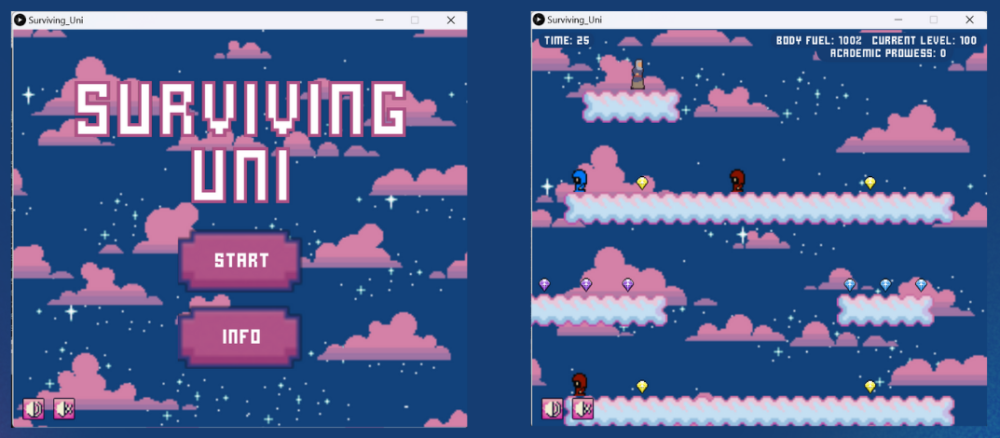
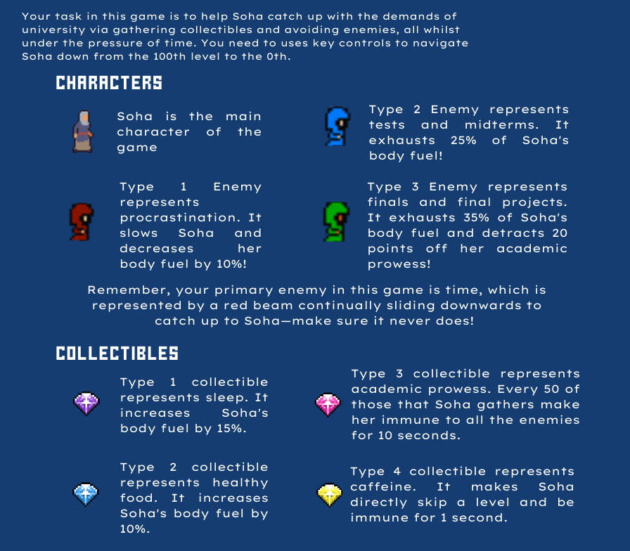

# Surviving Uni

## Screenshots

## Project Background
The gameplay is inspired by the classic arcade game *Pink Panther Jewel Heist*.

## Game Overview
*Surviving Uni* is a fast-paced, pixel-style game developed in **Processing Python**. Players help the main character, Soha, navigate the academic challenges of university life by outrunning obstacles and collecting power-ups, all while managing time and resources.

The goal is to descend through 100 levels, representing the journey through university, while avoiding academic-related enemies and maintaining Soha's body fuel. Time is the greatest enemy, represented by a red beam that continuously chases Soha downward. The game ends if Soha’s body fuel depletes or if the red beam catches up.

## Game Mechanics
Players control Soha by using the left and right arrow keys to move her horizontally across the platforms. For more information on the details of the game, please refer to the image below:

## Sample Playthroughs
You can watch the following playthroughs to get a sense of the gameplay:

- **[Winning Playthrough](https://drive.google.com/file/d/14_fKoOK1A-X1gGwm3OUu0i7j6mtQB7z9/view?usp=drive_link)**
- **[Losing Playthrough](https://drive.google.com/file/d/1UXb3R8-dekj0JICHfdsJk8eis271so7v/view?usp=drive_link) (Caught by Red Beam)**
- **[Losing Playthrough](https://drive.google.com/file/d/1nZ1jCF4QodVES5gsqL_tnCQikdIXhMD-/view?usp=drive_link) (Depleted Body Fuel)**

## How to Run

1. **Install Processing**:  
   Download and install Processing 3.5.4 from the official site: [Processing](https://processing.org/download/).

2. **Download the Repository**:  
   - Clone or download this repository.  
   - If downloading as a ZIP file, extract the contents to your desired folder.

3. **Open the Game File**:  
   Open Processing, and then open the `.pyde` file from the downloaded repository within Processing.

4. **Run the Game**:  
   Once the game file is open in Processing, click the "Run" button (or press `Ctrl + R`) to start the game.
